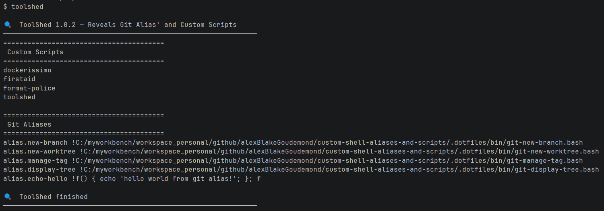

# README Custom Script

# Using .custom-scripts:
1. Clone this repo
2. Checkout the appropriate branch, for example: `dev`
3. Identify the absolute path to the script you care about, for example: `C:\<pathToRepository>\custom_shell_aliases_and_scripts\.custom-scripts\bin\<theBashScript>`
4. Navigate to the directory where you want custom-scripts defined, for example: `%USERPROFILE%\.custom-scripts`
5. Create a file in that custom-script location that has NO extension
6. Ensure that the custom-scripts directory is on your PATH
7. Add the below instructions to that custom script
8. Open the file in VS Code (or equivalent) and in the bottom right hand corner, choose the file type as `LF` and save

```bash
#!/usr/bin/env bash

WIN_PATH="<absolutePathToBashScript>"

# Try WSL path conversion first
if command -v wslpath >/dev/null 2>&1; then
	TARGET="$(wslpath -u "$WIN_PATH")"

# Otherwise assume Git Bash-style environment
elif command -v cygpath >/dev/null 2>&1; then
	TARGET="$(cygpath -u "$WIN_PATH")"

# Fallback: manual conversion for Git Bash-like shells
else
	TARGET="/c/${WIN_PATH#C:/}"
	TARGET="${TARGET//\\//}"
fi

bash "$TARGET" "$@"
```

> You should be able to just invoke the script by typing the name of the executable script!

## Example - docker-conduct
This script creates a new worktree and then leverages 'docker-conduct' to quickly manage docker containers
1. (N/A)
2. (N/A)
3. Absolute path is `C:\<pathToRepository>\custom_shell_aliases_and_scripts\.dotfiles\bin\docker-conduct.sh`
4. (N/A)
5. `docker-conduct` in bash terminal, `bash docker-conduct` in powershell terminal
6. (N/A)
7. (N/A)

Example Usage: 

## Example - toolshed
This script creates a new worktree and then leverages 'toolshed' to display git aliases and custom scripts
1. (N/A)
2. (N/A)
3. Absolute path is `C:\<pathToRepository>\custom_shell_aliases_and_scripts\.dotfiles\bin\custom-list-aliases-and-scripts.sh`
4. (N/A)
5. `toolshed` in bash terminal, `bash toolshed` in powershell terminal
6. (N/A)
7. (N/A)

Example Usage: 
