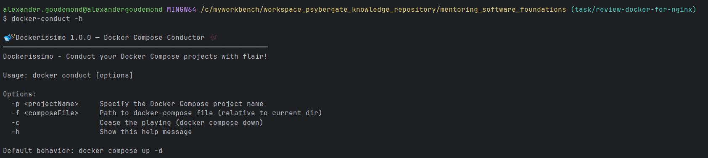

# README Custom Script

# Using .custom-scripts:
1. Clone this repo
2. Checkout the appropriate branch, for example: `dev`
3. Identify the absolute path to the script you care about, for example: `C:\myworkbench\workspace_psybergate_knowledge_repository\collaboration_custom_git_aliases\.custom-scripts\bin\<theBashScript>`
4. Navigate to the directory where you want custom-scripts defined, for example: `%USERPROFILE%\Scripts`
5. Create a file in that custom-script location that has NO extension
6. Ensure that the custom-scripts directory is on your PATH
7. Add the following instructions to that custom script:

```bash
#!/usr/bin/env bash
bash "<absolutePathToBashScript>" "$@"
```

> You should be able to just invoke the script by typing the name of the executable script!

## Example - docker-conduct
This script creates a new worktree and then leverages 'git new' to create a branch inside of it
1. (N/A)
2. (N/A)
3. Absolute path is `C:\myworkbench\workspace_psybergate_knowledge_repository\collaboration_custom_git_aliases\.dotfiles\bin\git-new-worktree.bash`
4. (N/A)
5. `docker-conduct`
6. (N/A)
7. (N/A)

Example Usage: 
