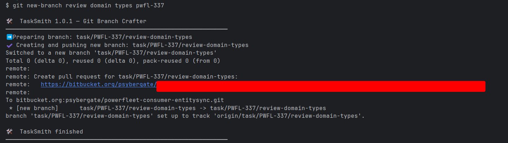
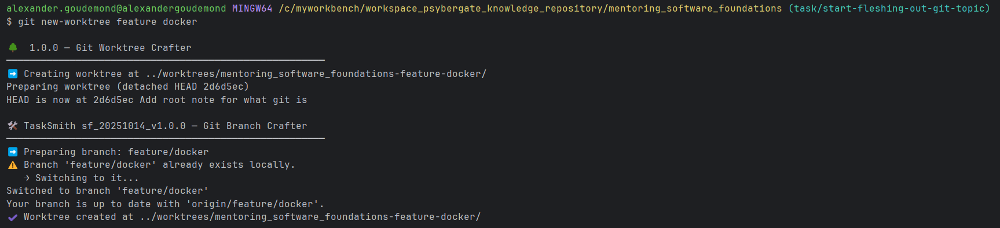
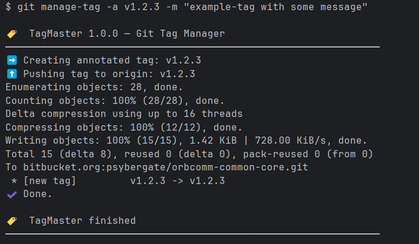

# README Git Alias

# Using .dotfiles scripts:
1. Clone this repo
2. Checkout the appropriate branch, for example: `dev`
3. Identify the absolute path to the script you care about, for example: `C:\myworkbench\workspace_psybergate_knowledge_repository\collaboration_custom_git_aliases\.dotfiles\bin\<theBashScript>`
4. Add that path as a git alias: `git config --global alias.<myAliasName> '!<theScriptsAbsolutePath>'`
5. Reload your shell: `source ~/.bashrc`
6. Use the command! `git <myAliasName> ...`

> The git alias will appear as an entry in the file: `~/.gitconfig`
> The 'key' is mapped to a 'value' - which is managed in this repository!

## Example - git new
This script creates and pushes a new branch with naming conventions
1. (N/A)
2. (N/A)
3. Absolute path is: `C:\myworkbench\workspace_psybergate_knowledge_repository\collaboration_custom_aliases_scripts\.dotfiles\bin\git-new.bash`
4. Git alias command: `git config --global alias.new '!C:/myworkbench/workspace_psybergate_knowledge_repository/collaboration_custom_aliases_scripts/.dotfiles/bin/git-new.bash'`
5. Reload the shell: `source ~/.bashrc`
6. Use the command! `git new abc-123 testing the new script` --> `task/ABC-123/testing-the-new-script`

Example Usage: 

## Example - git new-worktree
This script creates a new worktree and then leverages 'git new' to create a branch inside of it
1. (N/A)
2. (N/A)
3. Absolute path is `C:\myworkbench\workspace_psybergate_knowledge_repository\collaboration_custom_aliases_scripts\.dotfiles\bin\git-new-worktree.bash`
4. Git alias command: `git config --global alias.new-worktree '!C:/myworkbench/workspace_psybergate_knowledge_repository/collaboration_custom_aliases_scripts/.dotfiles/bin/git-new-worktree.bash'`
5. Reload the shell: `source ~/.bashrc`
6. Use the command! `git new-worktree abc-123 feature refactor customer service` --> Creates Worktree and branch (as outlined by 'git-new')

Example Usage: 

## Example - git manage-tag
This script creates a new tag and pushes to Origin
1. (N/A)
2. (N/A)
3. Absolute path is `C:\myworkbench\workspace_psybergate_knowledge_repository\collaboration_custom_aliases_scripts\.dotfiles\bin\git-manage-tag.bash`
4. Git alias command: `git config --global alias.manage-tag '!C:/myworkbench/workspace_psybergate_knowledge_repository/collaboration_custom_aliases_scripts/.dotfiles/bin/git-manage-tag.bash'`
5. Reload the shell: `source ~/.bashrc`
6. Use the command! `git manage-tag -a v1.0.0 -m test tag` --> Creates Tag and pushes to Origin

Example Usage: 

