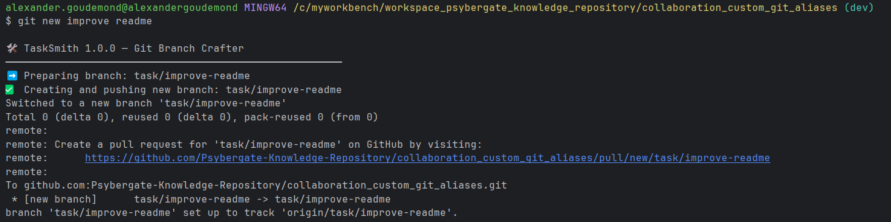

# collaboration_custom_git_aliases
A shared repository containing Git Alias' that can be used to improve workflows
Example Usage: 

# Using .dotfiles scripts:
1. Clone this repo
2. Checkout the appropriate branch, for example: `dev`
3. Identify the absolute path to the script you care about, for example: `C:\myworkbench\workspace_psybergate_knowledge_repository\collaboration_custom_git_aliases\.dotfiles\bin\<theBashScript>`
4. Add that path as a git alias: `git config --global alias.<myAliasName> '!<theScriptsAbsolutePath>'`
5. Reload your shell: `source ~/.bashrc`
6. Use the command! `git <myAliasName> ...`

> The git alias will appear as an entry in the file: `~/.gitconfig`
> The 'key' is mapped to a 'value' - which is managed in this repository!

## Example - Git New
This script creates and pushes a new branch with naming conventions
1. (N/A)
2. (N/A)
3. absolute path is: `C:\myworkbench\workspace_psybergate_knowledge_repository\collaboration_custom_git_aliases\.dotfiles\bin\git-new.bash`
4. Git Alias command: `git config --global.alias.new '!C:\myworkbench\workspace_psybergate_knowledge_repository\collaboration_custom_git_aliases\.dotfiles\bin\git-new.bash`
5. Reload the shell: `source ~/.bashrc`
6. Use the command! `git new abc-123 testing the new script` --> `task/ABC-123/testing-the-new-script`

# Other Info
Open to extension!
